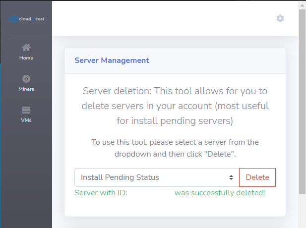
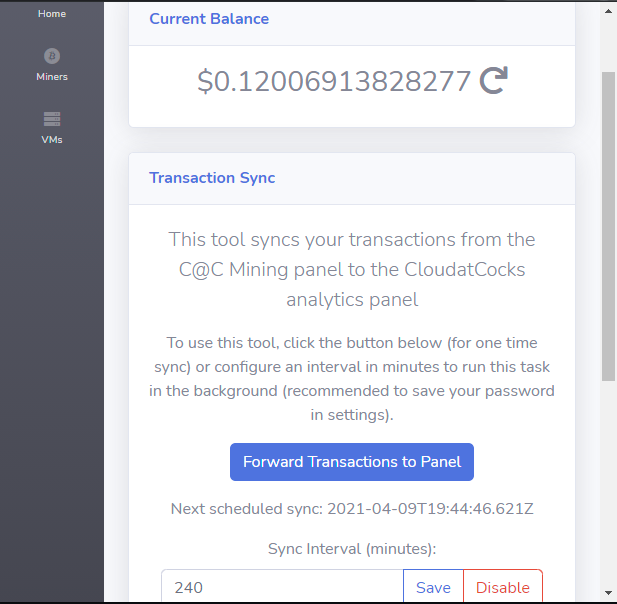
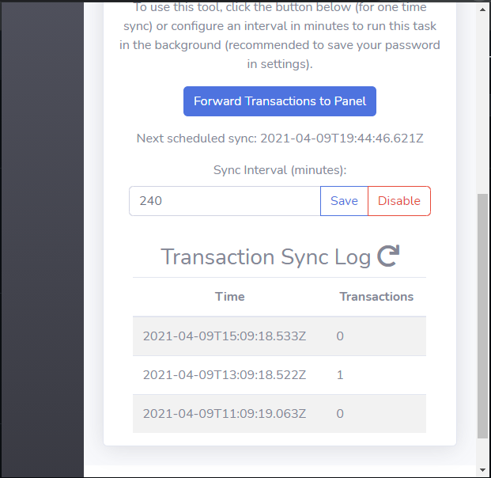

## Features
The current release (V0.1) allows you to do the following:
- Install hidden OSes or OSes from other Developer Cloud Versions
    - *NOTE:* These are not guaranteed to work and may result in "install pending" machines
- Deletion of install pending machines
- Syncing of mining statistics from the CloudAtCost Panel to the CloudAtCocks Panel
    - Ensure you have added your miner first in the CloudAtCocks panel
- Storing of login credentials for CloudAtCost and CloudAtCocks for autologin

## Installation
Either grab the latest release [here](https://github.com/zack-hable/CaC-Panel-Extension/releases/latest) or refer to the above available released copies on the Chrome Web Store and Firefox Addons store.

## Screenshots

### Hidden OS Injection

### Install Pending Server Deletion (or any server)

### Mining Wallet Sync and Current Balance

### Mining Wallet Syncing Log

